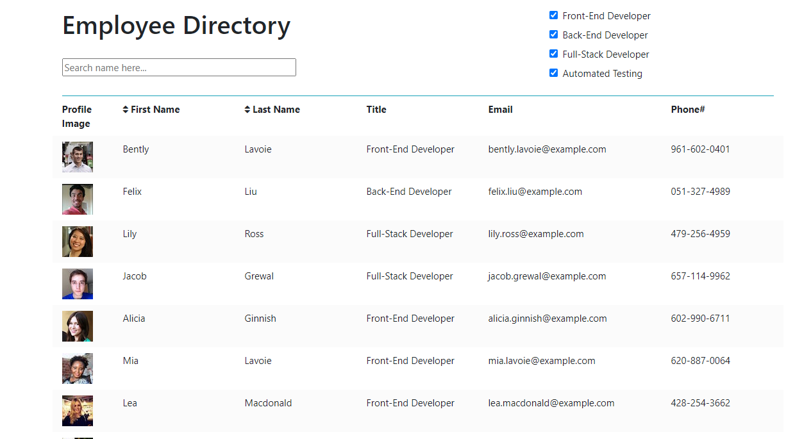

# Employee Directory

## Description

This web app is created with React in a business context where a easy employee information lookup is needed. This app allows user to quickly access to employee information including profile image, last name, first name, email and phone number. Some functionalities are implemented to boost lookup efficiency, such as sorting name, filtering title, searching name.

:link: Link to deployed application

## Installation and Usage

1. For run the application locally run `npm install` command at working directory.
2. Then run `npm start` to launch the web app.

### Lookup Employees at Ease

- Searching by name
- Sorting first name or last name in alphabetic order
- Filtering out employee titles

## Built with

- React
- Bootstrap 4.5
- Font Awesome 5

## License

This application is covered under the **MIT license**.

## Questions

Questions are welcome to send to me via [email](ziyonghe94@gmail.com) regarding to this applicaton.
